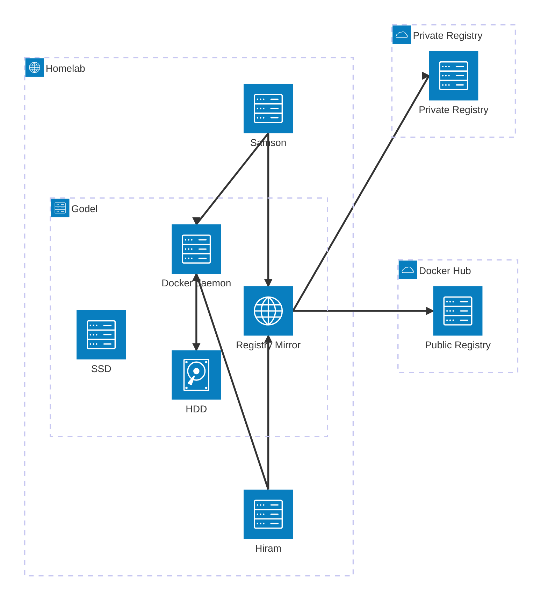

# Docker Architecture

## Opening: The Problem (and How I Stumbled Into the Solution)

A few years back, I was doing software development work on a laptop with 64GB of storage. Not by choice—it's just what I had. Docker and I became *very* well acquainted. Specifically, me and `docker system prune`. I'd run it constantly. And I was always shocked: "Wait, 50GB? Where did that come from?"

It became muscle memory. After a build, before a pull request—prune. It's like taking out the trash, except the trash keeps surprising you with how full it gets. And you're always terrified you'll accidentally delete something you needed.

Fast forward: I got better equipment. Better storage. I built a machine—call it Gödel—with decent specs, including an HDD I wasn't really using. And one day it hit me: I have a 1TB drive sitting here doing nothing. Docker is eating my SSD. Why am I still babysitting this?

So I did what anyone with a repurposed hard drive and too much free time would do: I set up a Docker daemon on Gödel, pointed both my workstations at it, and moved the image storage to the HDD.

What happened next was the interesting part. I stopped thinking about disk space. The daemon handled garbage collection automatically. My builds got faster because images were already there. My workstations could share layers without coordination. And that cold storage HDD? Turns out it's *exactly* what you want for something that doesn't need to be fast—just reliable and cheap.

This is the story of how that setup came together, and why it matters if you're juggling Docker across multiple machines.



## Registry Mirror

I used to think slow image pulls were just part of the Docker experience—something you lived with. Then I stumbled on registry mirrors and realized how easy it was to set one up. The real win showed up once Hiram and Samson were both pulling images: instead of each workstation downloading the same layers independently, they now share them through the mirror on Gödel. It's a small detail, but across dozens of pulls a week, it adds up—especially if your upstream connection is flaky or slow.

## The Shared Daemon: Intentional Centralization

**Problem**: Samson's dev workflow builds k8s images weekly for ECR—multiple versions stack up, but really only the latest matters. Babysitting `docker system prune` to clean up obsolete images isn't worth my time.

**Solution**: Instead of each workstation hoarding its own copies, push everything to Gödel's remote daemon. Let comprehensive garbage collection handle cleanup automatically. The GC policies (tiered reservedSpace, keepDuration filters per source type, aggressive all-images fallback) beat the blunt instrument of `docker system prune`—predictable, auditable, and hands-off.

**Trade-offs**: Remote auth setup can be forgotten (an extra config step), and it's easy to lose track of the fact that containers are actually running on Gödel, not your local machine. That cognitive overhead bites when you're debugging or checking logs. But switching back to the default Docker context is trivial if it gets too tricky, so the downside is low. For my workflow, centralized storage + intelligent GC is worth the occasional "wait, where is this running?" moment.

**Logging**: Using the local driver instead of the default json-file for better performance under container volume.

## Cold Storage Strategy

**Problem**: Gödel has limited fast storage. Dev servers benefit from SSD speed, but Docker artifacts (images, build cache, logs, backups) don't need that optimization and writes there waste SSD lifespan.

**Solution**: Split storage by access pattern. **500GB SSD for hot workloads** (dev server containers that need I/O speed). **1TB HDD for cold artifacts**—images, build cache, logs, and backups. These are mostly write-once or append-only; HDD handles them fine.

**Trade-off**: Image builds and container reads from HDD are slower than SSD. But for Samson's workflow, containers are ephemeral dev pods pushed to ECR anyway. If runtime speed becomes an issue, bind mount hot data to the SSD instead. The lifespan savings on SSD and overall cost reduction make it worth the trade.

## Btrfs Storage Driver

**Rationale**: Attracted by ZFS-like features—snapshots, self-healing, compression, easy subvolume resizing. These are valuable for long-lived infrastructure debugging and storage efficiency.

**Trade-off**: Docker's [official documentation](https://docs.docker.com/storage/storagedriver/btrfs-driver/) notes that btrfs uses significant memory. Gödel's current state:

```
Mem:            15Gi       3.1Gi       872Mi       4.0Mi        11Gi        12Gi
```

The buff/cache overhead is real and acknowledged.

**Current Status**: Experimental. The recommended driver for production workloads is `overlay2` (faster, lower memory cost). I'm validating whether the COW semantics and feature set justify the complexity and memory cost for this setup. If performance or memory pressure becomes an issue, switching back to `overlay2` is straightforward.
